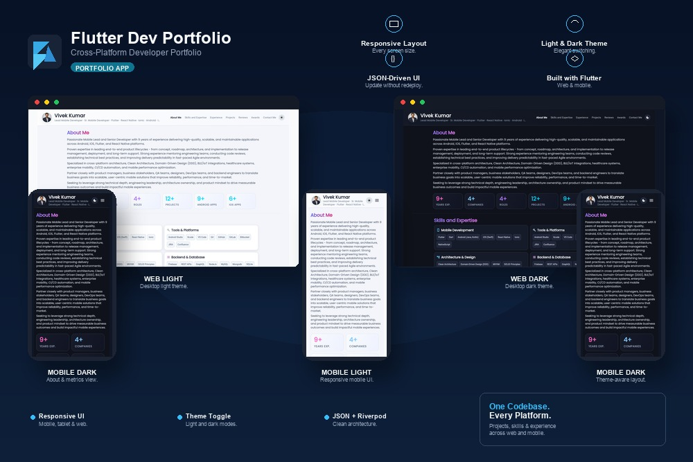

# Vivek Kumar — DevPortfolio (Flutter)

A responsive Flutter portfolio for Vivek Kumar — built with clean architecture, Riverpod, and go_router.

**Live site:** [https://vvk027.github.io/](https://vvk027.github.io/)

<p align="center">
  
</p>

## Table of contents

- [Features](#features)
- [Tech stack](#tech-stack)
- [Architecture](#architecture)
- [Theming](#theming)
- [Getting started](#getting-started)
- [Development](#development)
- [Build](#build)
- [Deploy to GitHub Pages](#deploy-to-github-pages)
- [Configuration](#configuration)
- [Assets](#assets)
- [License](#license)

## Features

- **Responsive layout** — Adaptive toolbar, spacing, and section layout for mobile, tablet, and desktop breakpoints.
- **Portfolio sections** — About, skills, experience, projects, reviews, awards, education, certifications, and contact, driven from `assets/data.json`.
- **Section navigation** — Sticky nav with scroll-synced active section via `ScrollablePositionedList`.
- **Deep links** — Shareable URLs for each section (`/section/:id`) with `go_router`.
- **Light and dark theme** — Material 3 themes with a semantic color system; toggle in the app bar (defaults to dark).
- **Projects gallery** — Tag filters, project cards with previews, and a detail bottom sheet.
- **Section carousels** — Paged carousels with controls and optional auto-play for multi-card content.
- **Contact and social** — Email, phone, location, and social links (GitHub, LinkedIn, WhatsApp, etc.) via `url_launcher`.
- **JSON-driven content** — Edit copy, metrics, experience, and projects without changing UI code.
- **CI pipeline** — Analyze, test, build web, and deploy on pushes to `main` (see [Deploy to GitHub Pages](#deploy-to-github-pages)).

## Tech stack

- Flutter & Dart
- Riverpod — state management
- go_router — URL navigation and section deep links
- json_serializable — typed JSON models
- ScrollablePositionedList — anchored section scrolling
- Poppins — bundled custom font family

## Architecture

```
lib/
├── domain/       # Entities, use cases, repository interfaces
├── data/         # Data sources, DTOs, mappers, repository implementations
├── presentation/ # Screens, widgets, Riverpod providers
└── core/         # App shell, routing, theming, providers
```

Data is loaded from `assets/data.json`, parsed on a background isolate, and mapped to domain entities.

## Theming

The app ships with **light** and **dark** Material 3 themes. Both share the same structure; colors and typography are tuned per brightness.

### How it works

| Piece | Role |
| --- | --- |
| `lib/core/theme/app_theme.dart` | Builds `lightTheme` and `darkTheme` (`ThemeData`, `ColorScheme`, component themes) |
| `lib/core/theme/app_colors.dart` | Semantic palette as a `ThemeExtension<AppColors>` (`AppColors.light` / `AppColors.dark`) |
| `lib/core/theme/app_fonts.dart` | Poppins family applied across the text theme |
| `lib/core/provider/app_theme_provider.dart` | Riverpod `themeModeProvider` — defaults to `ThemeMode.dark` |
| `lib/presentation/widgets/theme_toggle_button.dart` | Sun / moon control in the profile header |

`PortfolioApp` wires themes into `MaterialApp.router`:

```dart
theme: lightTheme,
darkTheme: darkTheme,
themeMode: themeMode, // from themeModeProvider
```

The toggle switches between `ThemeMode.light` and `ThemeMode.dark` for the current session. Preference is **not** written to local storage yet.

### Using colors in widgets

Prefer semantic tokens over hard-coded `Color` values:

```dart
import 'package:vivekdevfolio/core/theme/app_colors.dart';

final colors = context.appColors; // ThemeExtension helper
// colors.accent, colors.card, colors.textPrimary, …
```

`AppColors` covers layout surfaces (scaffold, card, borders), navigation, carousels, chips, project previews, store-link buttons, ratings, and contact/stat gradients. Add or adjust tokens in `app_colors.dart` for both `light` and `dark` static instances.

### Customizing themes

1. **Palette** — Edit `AppColors.light` and `AppColors.dark` in `lib/core/theme/app_colors.dart`.
2. **Typography** — Adjust sizes and weights in `_baseTextTheme` inside `lib/core/theme/app_theme.dart`.
3. **Default mode** — Change the initial value in `themeModeProvider` (`app_theme_provider.dart`).
4. **Fonts** — Replace files under `assets/fonts/` and update `pubspec.yaml` + `AppFonts.family`.

Light mode uses a soft slate-on-white look with indigo accents; dark mode uses deep navy surfaces with purple/violet accents and higher-contrast text.

## Getting started

**Prerequisites:** Flutter (stable) and Chrome for web.

```bash
flutter pub get
dart run build_runner build --delete-conflicting-outputs
flutter run -d chrome
```

## Development

```bash
# Static analysis
flutter analyze

# Tests (with coverage, matching CI)
flutter test --coverage

# Regenerate JSON models after changing portfolio_model.dart
dart run build_runner build --delete-conflicting-outputs
```

## Build

```bash
flutter build web --release
```

Output is in `build/web/`.

For a **project site** served at `https://<user>.github.io/<repo>/`, set the base path when building:

```bash
flutter build web --release --base-href="/<repo>/"
```

For a **user or organization site** at `https://<user>.github.io/`, use `--base-href="/"` (the default).

## Deploy to GitHub Pages

- **Build:** `flutter build web --release` (add `--base-href` if the app is not hosted at the domain root; see [Build](#build)).
- **Options**
  - Serve the `build/web` folder with any static host.
  - For GitHub Pages, enable Pages in the repository **Settings → Pages** and publish the build artifacts (for example, via a deploy workflow or a manual `gh-pages` branch).
- **Typical Pages deployment step** (append to a workflow after the web build):

```yaml
      - name: Deploy to GitHub Pages
        uses: peaceiris/actions-gh-pages@v3
        with:
          github_token: ${{ secrets.GITHUB_TOKEN }}
          publish_dir: ./build/web
```

This repository includes [`.github/workflows/main.yml`](.github/workflows/main.yml), which runs `flutter analyze`, tests, `flutter build web --release`, and deploys `build/web` via `peaceiris/actions-gh-pages`. Adjust `publish_dir`, branch, or `external_repository` in that workflow to match your Pages setup.

**Live site:** [https://vvk027.github.io/](https://vvk027.github.io/)

## Configuration

Portfolio content lives in **`assets/data.json`**. Key top-level fields include:

| Field | Purpose |
| --- | --- |
| `name`, `title`, `location`, `summary` | Profile header and about copy |
| `strengths` | Strength cards in the about area |
| `experience`, `education`, `certifications`, `awards` | Timeline and credential sections |
| `skills` | Grouped skill categories |
| `projects` | Gallery entries (tags, links, preview image paths) |
| `reviews` | Client/colleague testimonials |
| `contact` | Email, phone, social URLs |

After editing JSON, hot restart the app (or rebuild for release). No code changes are required unless you add new fields that need UI support.

## Assets

```
assets/
├── data.json           # All portfolio copy and structured data
├── profile.jpeg        # Profile photo
├── fonts/              # Poppins Regular & Italic
├── icons/              # SVG social icons (GitHub, LinkedIn, WhatsApp, …)
└── projects/           # Project preview images (*_preview.jpg)
```

## License

MIT — see [LICENSE](LICENSE).
